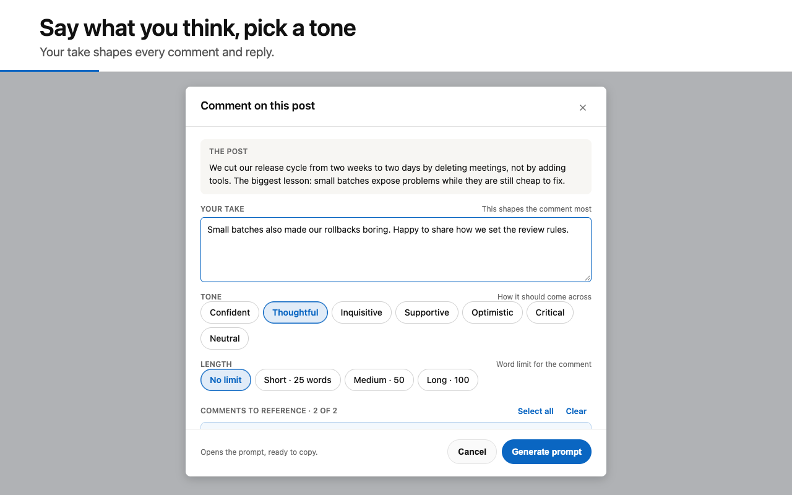
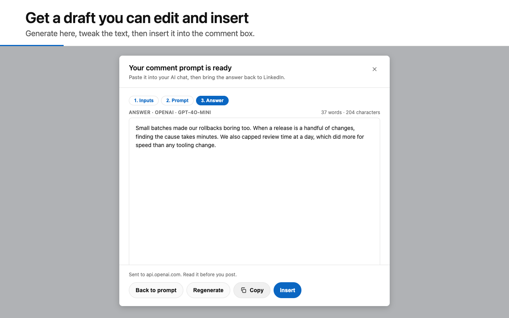
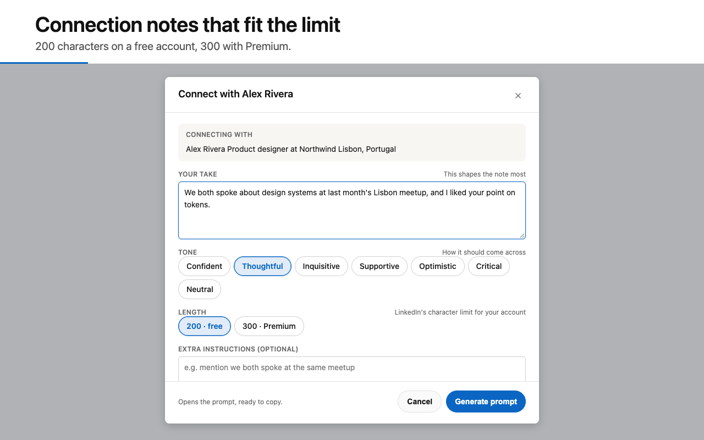
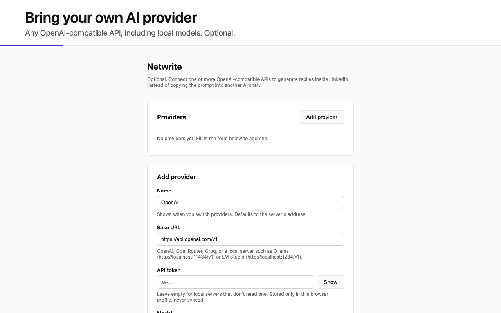
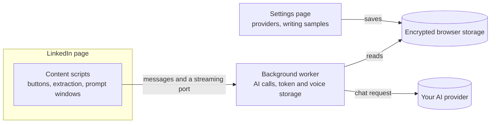

<p align="center">
	
</p>

<h1 align="center">Netwrite</h1>

<p align="center">
	Draft comments, replies, and connection notes for LinkedIn, in your own voice.<br>
	Bring your own AI provider, or just copy the prompt into any chat.
</p>

<p align="center">
	<a href="LICENSE"></a>
	<a href="https://github.com/ersanyamarya/netwrite/actions/workflows/ci.yml"></a>
</p>

<table>
	<tr>
		<td></td>
		<td></td>
	</tr>
	<tr>
		<td></td>
		<td></td>
	</tr>
</table>

> Netwrite is an independent project. It is not affiliated with, endorsed by, or sponsored by LinkedIn. See [Trademarks](#trademarks-and-affiliation).

## What it does

A lightbulb button appears where you write on LinkedIn. You tell Netwrite what you think, and it builds a prompt from the post, the comments, or the profile in front of you.

- **Comments and replies.** Pick a tone and a length, and reference other comments. When the editor is a reply box, the prompt switches to reply wording.
- **Connection notes.** Written from the profile, with the 200 character (free) or 300 character (Premium) limit built in.
- **Messages.** Quick-reply presets and a reply form for message threads and chat pop-ups.
- **Profile summary, reposts, and job pages.** Prompts for a profile summary, a repost with your thoughts, and a job description.
- **Your voice.** Add up to five writing samples on the settings page and every prompt uses them.
- **Refine and check.** Rewrite a draft with one click (shorter, more casual, more direct, add a question, more specific). A local check flags filler wording and drafts that run long.
- **Your choice of AI.** Copy the prompt into any chat, or connect an OpenAI-compatible API (hosted, or a local server such as Ollama or LM Studio) and generate inside the page. Save several providers and switch between them.

Netwrite writes drafts. You read them, edit them, and post them yourself.

## Privacy

- There is no Netwrite server, no account, and no analytics. The only network request the extension makes goes to the AI provider you set up, and only when you click **Generate** or **Load models** on the settings page.
- What it sends is the prompt you can see and edit before you send it.
- Your API token and writing samples are stored encrypted in the browser profile and never synced. Only the background worker reads them, so the scripts running on LinkedIn pages can't.
- If you don't connect a provider, nothing leaves the page. You copy the prompt yourself.

## Install

You need Chrome, or another Chromium-based browser.

1. Download `netwrite-v<version>.zip` from the [latest release](https://github.com/ersanyamarya/netwrite/releases/latest) and unzip it.
2. Open `chrome://extensions` and turn on **Developer mode**.
3. Click **Load unpacked** and pick the unzipped folder.
4. Refresh LinkedIn.

Chrome doesn't update unpacked extensions. To upgrade, replace the folder's contents with the new zip and click the reload icon on the extension card.

To generate inside LinkedIn, click the Netwrite toolbar icon to open the settings page, then **Add provider**. Chrome asks you to allow access to that provider's address.

## Use it

1. Open the LinkedIn feed, a post, a message thread, or a profile.
2. Click the lightbulb next to the comment box (or the connection note button on a profile).
3. Add your take, pick a tone and a length, and click **Generate prompt**.
4. Copy the prompt, or click **Generate** if you've connected a provider. Edit the draft, then **Insert** it into the comment box.

## How it works



1. **Detect.** A `MutationObserver` in each content script watches for comment editors, message composers, profile headers, and job pages. Each one is marked with `data-mutated` so a button is only added once.
2. **Extract.** A click reads the post and its visible comments, the last messages in a thread, or the profile. Zod schemas in `src/lib/schemas.ts` validate what was read.
3. **Ask.** A form collects your take, tone, and length. `src/prompt/` turns that into one prompt, and adds your writing samples.
4. **Answer.** The prompt window shows three steps: inputs, the prompt, and the answer. With a provider set, the content script asks the background worker to generate, and the reply streams back over a port. Content scripts never see the token.

The code reads the page with several selectors per element, because LinkedIn's markup changes. All of them live in `src/lib/constants.ts`.

## Develop

You need [Bun](https://bun.sh) and Chrome.

```bash
bun install
bun run dev
```

Load `dist/` through **Load unpacked** as above. `bun run dev` rebuilds on every change, so reload the extension and refresh LinkedIn after an edit.

| Command | What it does |
|---|---|
| `bun run build` | Clean build into `dist/` |
| `bun test` | Checks the built extension (build first) |
| `bun run format` | Fixes style with Ultracite (Biome) |
| `bun run security` | Lockfile, manifest CSP, and secret checks |
| `bun run package` | Builds and zips into `release/` |
| `bun run release:prepare` | Bumps the version and drafts the changelog (see Releasing) |
| `bun run release` | Checks, tags, and pushes a release (see Releasing) |
| `bun run icons` | Regenerates the PNG icons from `public/logo.svg` |
| `bun run store-assets` | Regenerates the screenshots and promo images in `store-assets/` |

### Project structure

```
src/
├── background/        # Service worker (AI calls, messaging) and encrypted voice storage
├── content-scripts/   # editable-text-area.ts (comments, replies, messages, reposts),
│                      # profile.ts, job-description.ts, extract/ (DOM readers)
├── options/           # Settings page logic
├── lib/               # Selectors and constants, Zod schemas, AI client and settings,
│                      # voice samples, the local wording check
├── prompt/            # One prompt builder per kind of writing
├── ui/                # Prompt windows, quick replies, notices, base components
└── crypto-key.ts      # AES-GCM encryption for the API token and samples

public/                # manifest.json, options page, styles.css, logo.svg, icons/
scripts/               # Packaging, security checks, image generators
store-assets/          # Screenshots and promo images
tests/                 # Checks on the built extension
```

Conventions and the pull request checklist are in [CONTRIBUTING.md](CONTRIBUTING.md).

## Releasing

1. Run `bun run release:prepare patch` (or `minor`, `major`, or an exact version like `1.0.0`). It bumps `version` in `public/manifest.json` and drafts a `CHANGELOG.md` section from the commit messages since the last tag.
2. Edit that section for users, and delete its `TODO` line.
3. Get the version bump and the changelog onto `main`.
4. Run `bun run release`. It checks that you're on `main` with nothing uncommitted, that the changelog section is finished and the tag is new, and that security, build, tests, and lint pass. After you confirm, it tags the commit and pushes `main` and the tag.
5. The Release workflow builds the zip and publishes the GitHub release, using the changelog section as the notes. Watch it in the Actions tab.

`bun run release -- --dry-run` runs every check without tagging or pushing. The release script never creates a commit.

## Contributing

Read [CONTRIBUTING.md](CONTRIBUTING.md) first. Please follow the [Code of Conduct](CODE_OF_CONDUCT.md), and report security problems privately as described in [SECURITY.md](SECURITY.md).

## License

[MIT](LICENSE)

## Trademarks and affiliation

LinkedIn is a trademark of its owner. Netwrite is an independent project and has no connection to LinkedIn. Using it on LinkedIn is your responsibility: read LinkedIn's terms, review every draft, and post it yourself.
